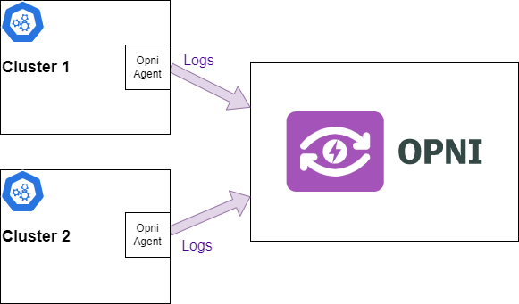
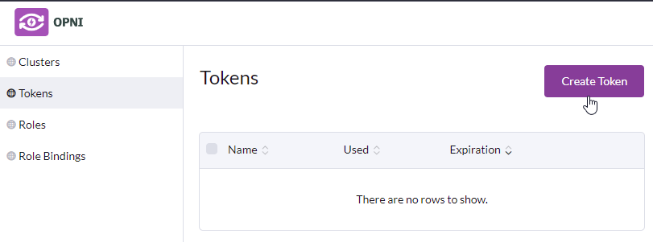

{ loading=lazy }

Following this guide will allow you to create a POC Opni logging cluster

### Install cert manager in all clusters
All clusters need cert manager as a prerequisite.  This can be installed by following the [cert manager instructions](https://cert-manager.io/docs/installation/kubectl/)

### Rancher Charts
Opni provides helm charts that integrate with Rancher.  If you are using Rancher you can add these to the UI by adding a git repository to the Apps & Marketplace section.  The `Git Repo URL` to use is:
```
https://github.com/rancher/opni.git
```

The `Git Branch` to use is:
```
charts-repo
```

If you are not using Rancher please follow the instructions below.

### Install Opni
Opni needs to be installed into all clusters - the centralized cluster, and the downstream clusters that will be shipping their logs.
This can be achieved by applying the following manifests from the [Opni repo](https://github.com/rancher/opni/tree/main/deploy/manifests)

 - 00_crds.yaml
 - 01_rbac.yaml
 - 10_operator.yaml

### Install Opensearch
Opni makes use of, and contributes to, the official Opensearch operator.  This is currently hosted at [https://github.com/Opster/opensearch-k8s-operator](https://github.com/Opster/opensearch-k8s-operator).

The cluster must be called Opni and installed into the `opni-cluster-system` namespace. Create this namespace on your cluster if it does not already exist.  The following yaml can be used to create the cluster
```yaml
apiVersion: opensearch.opster.io/v1
kind: OpenSearchCluster
metadata:
  name: opni
  namespace: opni-cluster-system
spec:
  # Add fields here
  general:
    httpPort: 9200
    vendor: opensearch
    version: 1.3.1
    serviceName: os-svc
    setVMMaxMapCount: true
  confMgmt:
    autoScaler: false
    monitoring: false
  dashboards:
    enable: true
    version: 1.3.1
    replicas: 1
    image: rancher/opensearch-dashboards:1.3.1
  nodePools:
  - component: master
    replicas: 3
    diskSize: 32Gi
    resources:
      requests:
        cpu: 500m
        memory: 1Gi
      limits:
        memory: 1Gi
    roles:
    - master
    persistence:
      emptyDir: {}
  - component: nodes
    replicas: 2
    diskSize: 32Gi
    resources:
      requests:
        cpu: 500m
        memory: 2Gi
      limits:
        memory: 2Gi
    jvm: "-Xmx1G -Xms1G"
    roles:
    - data
    persistence:
      emptyDir: {}
```

If you want to use persistent storage you can replace
```yaml
emptyDir: {}
```
with
```yaml
pvc:
  storageClass: nameofclass # Name of the storage class you wish to use
  accessModes:
  - ReadWriteOnce
```

You will also need to expose the Opensearch cluster.  For indexing it is recommended to expose the data nodes.  This can be achieved with the following service
```yaml
apiVersion: v1
kind: Service
metadata:
  name: expose-nodes
  namespace: opni-cluster-system
  labels:
    opster.io/opensearch-cluster: opni
    opster.io/opensearch-nodepool: nodes
spec:
  ports:
  - name: http
    port: 9200
    protocol: TCP
    targetPort: 9200
  selector:
    opster.io/opensearch-cluster: opni
    opster.io/opensearch-nodepool: nodes
  type: NodePort
```

If you are using a Load Balancer you can change the service type to LoadBalancer and if you do choose to use a ClusterIP you will also need an ingress for the service.

### Opensearch Cluster Binding
Next you will need to create an Opensearch Cluster Binding.  This triggers Opni to install the index policies and generic roles it needs into the Opensearch cluster.  This can be achieved by applying the following manifest:
```yaml
apiVersion: opni.io/v1beta2
kind: MulticlusterRoleBinding
metadata:
  name: opni-logging
  namespace: opni-cluster-system
spec:
  opensearch:
    name: opni
    namespace: opni-cluster-system
  opensearchExternalURL: https://opensearchurl # This should be replaced with the URL that the Opensearch data node service is exposed on
```
If you are using NodePort, you can take the IP address of one of your nodes and then append the port number of the expose-nodes service to get your Opensearch external URL.

### Install Opni Gateway
Install the [Opni Gateway](https://github.com/rancher/opni-monitoring) into the central cluster. This can be completed using the [helmfile](https://github.com/rancher/opni-monitoring/blob/main/deploy/helmfile.yaml)

The helm file will create a LoadBalancer service for the gateway endpoints. If you are using a NodePort, you can edit the opni-monitoring service once it has been created and change the type from Load Balancer to Node Port. If you are not using NodePort or a load balancer, you will need an ingress (or kubectl port-forward) for the endpoints.

### Generate a token for bootstrapping the cluster
This can be done in the Opni Gateway UI

{ loading=lazy }

### Bootstrap downstream cluster
The command to bootstrap a logging cluster can be copied from the Clusters section in the UI.  Make sure to select the logging capability.

!!! attention
    The gateway URL should exposed with ssl passthrough.  This is because the client uses cert pinning, and the pins are computed based on the serving certs.

```sh
opnictl bootstrap logging NAME [--insecure-skip-tls-verify] --gateway-url https://OPNI-GATEWAY-URL --token=TOKEN --pin=PIN
```

 - NAME is the friendly name of the cluster. Different clusters should use a different name.
 - OPNI-GATEWAY-URL should be the address of the Opni Gateway API you have exposed.
 - TOKEN is the token from the UI.
 - PIN is the pin from the UI.

Once this command successfully completes the downstream cluster should begin shipping logs to the exposted Opensearch URL from the binding.
